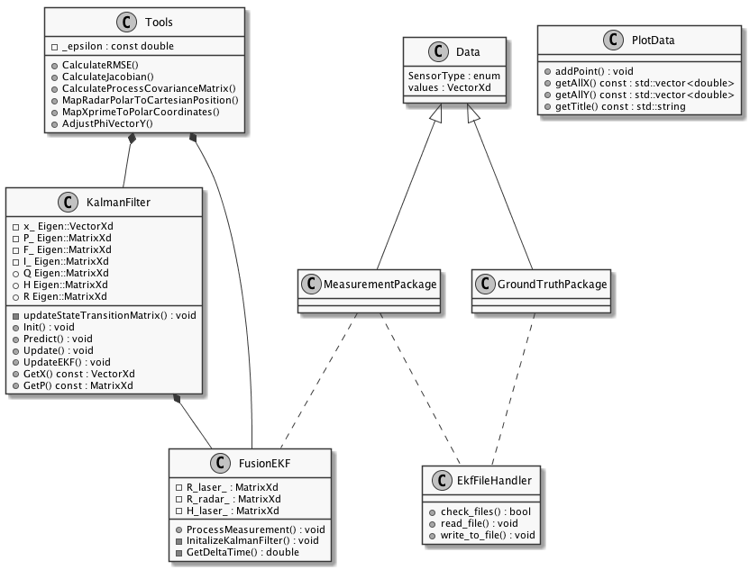

# Extended Kalman Filter Project 
Self-Driving Car Engineer Nanodegree Program Project 1 - Term 2

---

## Dependencies

* cmake >= 3.5
* make >= 4.1
* gcc/g++ >= 5.4

## Basic Build Instructions

1. Clone this repo.
2. Make a build directory: `mkdir build && cd build`
3. Compile: `cmake .. && make` 
   * On windows, you may need to run: `cmake .. -G "Unix Makefiles" && make`
4. Run it: `./ExtendedKF path/to/input.txt path/to/output.txt`. You can find
   some sample inputs in 'data/'.
    - eg. `./ExtendedKF ../data/sample-laser-radar-measurement-data-1.txt output.txt`

## Overview

## Result

